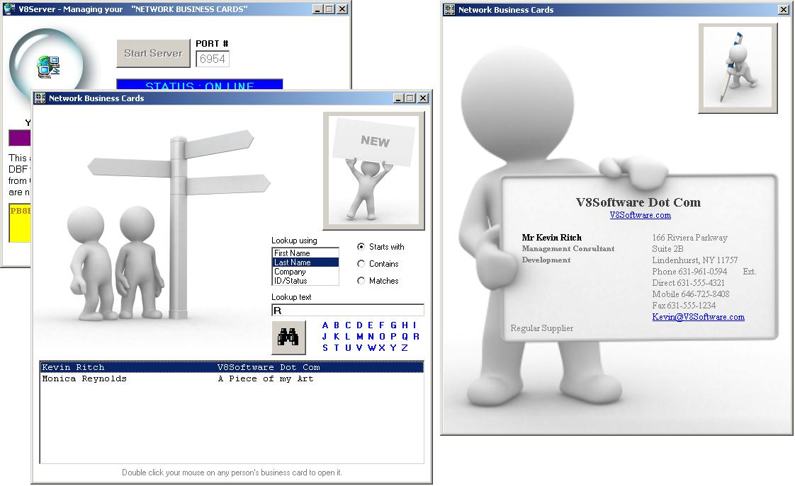



## CLIENT/SERVER APP \- BUSINESS CARDS ON A LAN \- ONLY ONE OCX REQUIRED \- NO COMPONENTS FOR CLIENT APPS

### Description

V8Server is a 100% pure DBF Network File Server Application. But it could easily be modified to handle any database file format.

With V8Server, you only need to install ONE OCX, namely WinSock.

Any number of PC's on a network (TCP/IP) can then SHARE a DBASE file.

This example submission is called:

Network-Business-Cards and is completely OPEN SOURCE CODE.

Please note this... The Client Apps do *NOT* need ANY OCX or DLLs etc!!!

Get out there and make some consultancy income using this as the core of YOUR exciting Client/Server project!

And ENJOY!

Cheers,

Kevin Ritch

V8Software
 
### More Info
 
The client app does NOT require a single OCX or DLL to be installed. Only the server does - and that's the WinSock OCX. Period.

This version assumes that the IP Address on the selected *server* PC remains static.

             |
---                |---
**Submitted On**   |2007-07-15 16:50:38
**By**             |[Kevin Ritch](https://github.com/Planet-Source-Code/PSCIndex/blob/master/ByAuthor/kevin-ritch.md)
**Level**          |Advanced
**User Rating**    |4.6 (51 globes from 11 users)
**Compatibility**  |VB 6\.0
**Category**       |[Complete Applications](https://github.com/Planet-Source-Code/PSCIndex/blob/master/ByCategory/complete-applications__1-27.md)
**World**          |[Visual Basic](https://github.com/Planet-Source-Code/PSCIndex/blob/master/ByWorld/visual-basic.md)
**Archive File**   |[CLIENT\_SER2076747232007\.zip](https://github.com/Planet-Source-Code/kevin-ritch-client-server-app-business-cards-on-a-lan-only-one-ocx-required-no-components-__1-69003/archive/master.zip)

